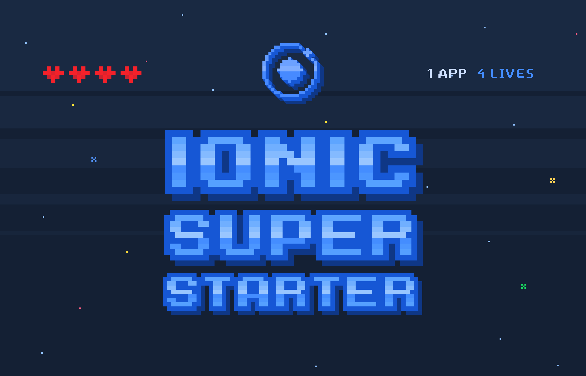

__WORK IN PROGRESS, NOT READY FOR USE__

# The Ionic Super Starter 🎮

The Ionic Super Starter is a batteries-included starter project for Ionic 2.x apps complete with pre-built pages, providers, , and best practices for Ionic development.

The goal of the Super Starter is to get you from zero to app store faster than before, with a set of opinions from the Ionic team around page layout, data/user management, and project structure.

The way to use this starter is to pick and choose the various page types you want use, and remove the ones you don't. If you want a blank slate, this starter isn't for you (use the `blank` type instead).

One of the big advances in Ionic 2 was moving from a rigid route-based navigation system to a flexible push/pop navigation system modeled off common native SDKs. We've embraced this pattern to provide a set of reusable pages that can be navigated to anywhere in the app. Take a look at the [Settings page](https://github.com/driftyco/ionic-starter-super/blob/master/src/pages/settings/settings.html#L38) for a cool example of a page navigating to itself to provide a different UI without duplicating code.

## Table of Contents

1. [Pages](#pages)
2. [i18n](#i18n) (adding languages)

## Pages

The Super Starter comes with a variety of ready-made pages. These pages help you assemble common building blocks for your app so you can focus on your unique features and branding.

By default, the app loads with the TutorialPage as the first entry page. If the user has already gone through the tutorial, this page will be skipped.

Once the user is authenticated, the app will load with the Tabs page as the default page.

The entry and main pages can be configured easily by updating the corresponding variables in [src/pages/pages.ts](https://github.com/driftyco/ionic-starter-super/blob/master/src/pages/pages.ts).

### Tutorial

The Tutorial page is a slider that walks the user through an introduction to your app.

### Login

The Login page is a simple login/signin form

### Signup

The Signup page is a simple signup/create account form

### Welcome

The Welcome page is a "splash" page that directs the user to login or signup, or whatever else you like to display to the user as a welcome message.

Many users will prefer showing the login or signup page first, and not using the splash. YMMV.

### Tabs

For apps that wish to utilize a tabbed layout, the Tabs page starts with a default of four tabs and uses some of the other content pages as the default tab root pages.

### List Master

For those that wish to use a master-detail style page. This is the Master list view that lets you render a selection of items with an optional search, edit/swipe items, and push to the List Detail page.

### List Detail

The List Detail page is `pushed` to by the List Master, to view or edit a specific item (for example, a Contact).

### Map

The Map page renders a Map, (currently Google maps), using either the JS maps or native Google Maps if desired.

## Providers

The Super Starter comes with some basic implementations of common providers.

### User

The `User` provider is used to authenticate users through its `login(accountInfo)` and `signup(accountInfo)` methods, which perform `POST` requests to an API endpoint that you will need to configure.

## i18n

Ionic Super Starter comes with internationalization (i18n) out of the box with [ng2-translate](https://github.com/ocombe/ng2-translate). This makes it easy to change the text used in the app by modifying only one file.

By default, the only language strings provided are American English.

### Adding Languages

To add new languages, add new files to the `src/assets/i18n` directory, following the pattern of LANGCODE.json where LANGCODE is the language/locale code (ex: en/gb/de/es/etc.).

### Changing the Language

To change the language of the app, edit `src/app/app.component.ts` and modify `translate.use('en')` to use the LANGCODE from `src/assets/i18n/`
